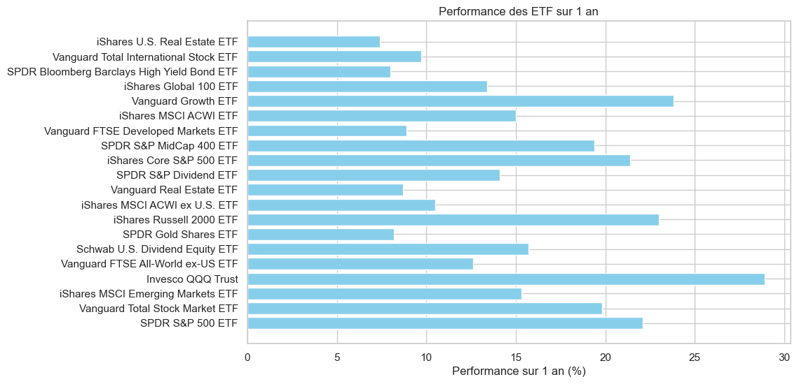

# API - AWS

# Traitement des données ETF

Ce projet vise à traiter et analyser les données d'ETF (Exchange-Traded Funds) provenant de l'API suivante :  
[API des ETF](https://re6th24hj3.execute-api.eu-north-1.amazonaws.com/default/ETF)

## Qu'est-ce qu'un ETF ?
Un ETF (Exchange-Traded Fund), ou fonds négocié en bourse, est un type de fonds d'investissement coté en bourse qui regroupe un panier d'actifs (actions, obligations, matières premières, etc.). Les ETF permettent aux investisseurs de diversifier facilement leur portefeuille en suivant la performance d'un indice boursier, d'un secteur ou d'une région spécifique, le tout avec des frais généralement réduits par rapport aux fonds traditionnels. Ils sont achetés et vendus comme des actions classiques tout au long de la journée de bourse.

## Fonctionnalités
- Récupération des données via l'API.
- Traitement et nettoyage des données.
- Analyse des performances sur 1, 3 et 5 ans.
- Visualisation des données principales.

## Installation
```bash
pip install requests matplotlib pandas
```

## Utilisation
```bash
python etf_analysis.py
```

## Résultats 




